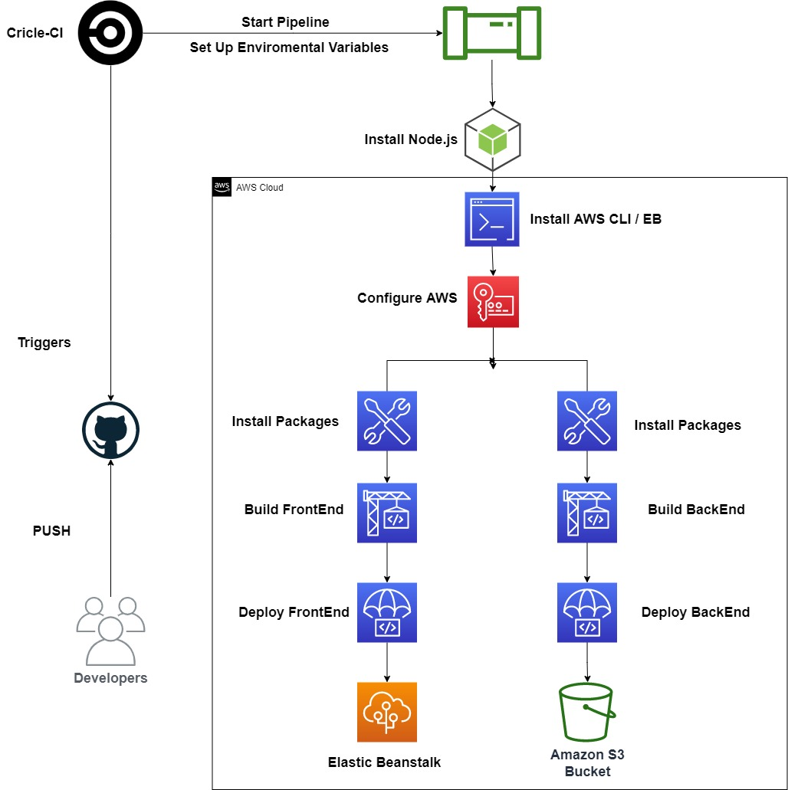

# Continuous Integration

The developers regularly Pushes code changes into a repository, then the automated builds and tests are run.

- Continuous integration refers to the (**build and unit testing**) stages of the software release process. Every revision that is committed triggers an automated build and test.

## Pipeline Architecture

---

## GitHub

The developer commit and push the code to the GitHub repository, which is linked to the CircleCI platform. GitHub triggers the CircleCI platform when code is pushed to the repository.

---

## CircleCI

CircleCI automatically runs the build and test processes whenever the developer commit code, and then displays the build status in the GitHub branch.
First step is to create a `config.yml` in the project’s root directory and CircleCI will read it each time it runs a build.

- Frontend: Runs the script in the `package.json` file. Then the command in `deploy.sh` will run to upload the frontend asstes to S3 bucket.
- API: Runs the script in `package.json`. Then the command in `deploy.sh` will run to set the env variables to EB which are configured inside CircleCi and passed to the production application. Finally EB will upload the archive file to deploy the server by AWS CLI.

### Environment Variables

### build in CircleCi

